<p align="center">
  
</p>

<p align="center">
  <a href="https://github.com/Y0oshi/lain-psx-decompiled/actions/workflows/port.yml"></a>
  <a href="https://github.com/Y0oshi/lain-psx-decompiled/releases"></a>
  
  
  
  
  <a href="LICENSE"></a>
</p>

This is a **decompilation** of ***Serial Experiments Lain*** (PlayStation, Pioneer LDC, 1998)
and a **native client** for Windows, macOS and Linux built from it.

The decompilation recreates the game's source code in C. Compiled with the original
PsyQ toolchain, it rebuilds an executable byte-identical to the retail one. The native
client runs the same code on a reimplementation of the PlayStation SDK, with no emulator.

| Disc | Serial | Executable | SHA-1 of the data track (Redump) |
|---|---|---|---|
| Disc 1 | SLPS-01603 | `SLPS_016.03` | `6426fbdb45f27e089af650cddb8c41929c7890de` |
| Disc 2 | SLPS-01604 | `SLPS_016.04` | `409668af454a0e0a33a71c1d22918d765e718608` |

The rebuilt `SLPS_016.03` has SHA-1 `a0012634f82dd7fcc4ee5a3f97ddc052573b4815`. Disc 2's
executable is identical.

> [!IMPORTANT]
> This repository and its releases contain **no game data**. Movies, voices, images, sounds,
> text and data tables are read from your own dump of the two original discs.

## Playing

1. Dump both discs in Redump format (`.cue` + `.bin`).
2. Download the client for your system from [Releases](https://github.com/Y0oshi/lain-psx-decompiled/releases):

   | System | Package | First launch |
   |---|---|---|
   | Windows 10/11 (x64) | `Lain-windows.zip` | Run `lain.exe`. On a SmartScreen warning: *More info*, *Run anyway*. |
   | macOS (Apple Silicon) | `Lain-macos.zip` | Right-click `Lain.app`, *Open*. |
   | Linux (x86-64, glibc 2.35+) | `Lain-linux-x86_64.tar.gz` | Run `./lain`. Needs OpenGL 3.2. |

   The builds are not signed.
3. In the launcher, add both discs (file picker or drag and drop). The client verifies them
   and copies them into its data folder.
4. Choose window size, subtitles and options, then press **Play**.

**F1** opens the in-game menu: display, volume, languages, key bindings and cheats.

| PlayStation | Keyboard | In Lain |
|---|---|---|
| D-pad | Arrow keys | Move the cursor, select a node |
| ○ | V | Confirm, open a node |
| × | C | Back |
| △ | Z | Menu (load, save, ...) |
| Start | Return | Continue, skip |

Gamepads work as controller 1. Full controls and options:
[port/PORTING.md](port/PORTING.md#playing).

### Features

| Feature | Details |
|---|---|
| Original behaviour | Game logic, timing and pacing match the PlayStation, measured on real hardware. |
| Display | Resolution scaling, fullscreen, optional 60 fps motion interpolation at the original game speed. |
| Subtitles and dubs | Plain `.srt`, `.ass` and `.ogg` folder packs. The launcher can download the laingame.net English fan subtitles from their source; none are bundled. |
| Saves | Standard 128 KiB memory card images (`.mcd`), usable with emulators. |
| Unused content | A launcher tab showing content on the discs that the game never uses, decoded from your own dump. See [docs/findings](docs/findings/README.md). |

## Status

| Part | State |
|---|---|
| Decompilation (`src/`) | All 321 game functions are C that compiles to the original bytes, and the EXE is byte-identical. Sony's PsyQ libraries link from their original code. |
| Native client (`port/`) | Plays the whole game: both sites, all voice sessions and movies, disc swap, all four endings. |
| Naming | Most functions, globals and struct fields are named. |

Open work is tracked in [docs/ROADMAP.md](docs/ROADMAP.md).

## Building the client

Requirements: CMake, a C/C++ compiler, SDL2 and OpenAL (openal-soft).

```sh
# macOS:  brew install cmake ninja sdl2 openal-soft
# Linux:  apt install cmake ninja-build libsdl2-dev libopenal-dev libgl-dev
cmake -S port -B build/port -G Ninja -DCMAKE_BUILD_TYPE=Release
cmake --build build/port
build/port/lain
```

The Windows build is cross-compiled with MinGW-w64 in Docker, from macOS or Linux
(`port/tools/package_windows.sh` below).

Release packages link every dependency statically:

```sh
port/tools/package_macos.sh     # dist/Lain-macos.zip
port/tools/package_windows.sh   # dist/Lain-windows.zip (MinGW-w64 in Docker)
port/tools/package_linux.sh     # dist/Lain-linux-x86_64.tar.gz (Ubuntu 22.04 in Docker)
```

## Building the decompilation

Requirements: Python 3, Docker (provides GCC 2.8.1-psx and maspsx), and both disc dumps.

```sh
python3 -m venv .venv && . .venv/bin/activate
pip install -r requirements.txt
tools/disc.py extract path/to/disc1.cue --disc 1
tools/disc.py extract path/to/disc2.cue --disc 2
tools/docker.sh make split   # disassemble the executable into asm/
tools/docker.sh make         # compile, link and verify
```

A successful build ends with `build/SLPS_016.03: OK`. To work on functions, see
[docs/MATCHING.md](docs/MATCHING.md).

## Repository layout

| Path | Contents |
|---|---|
| `src/` | Decompiled game code (matching) |
| `include/`, `config/` | Headers, splat configuration, symbol maps |
| `tools/` | Disc extraction, build and matching tools |
| `port/game/` | 64-bit copy of the game code used by the client |
| `port/psx/` | PlayStation SDK reimplementation, based on PsyCross |
| `port/client/` | Launcher, overlay, settings, subtitle and dub packs |
| `docs/` | Technical documentation and findings |

## Documentation

| Document | Topic |
|---|---|
| [DECOMPILATION.md](docs/DECOMPILATION.md) | How the decompilation is organised |
| [MATCHING.md](docs/MATCHING.md) | Matching workflow and tools |
| [PORTING.md](port/PORTING.md) | Client internals, pack formats, options |
| [findings](docs/findings/README.md) | Unused and hidden content |
| [ROADMAP.md](docs/ROADMAP.md) | Open work |

## License

The code in this repository is released under the [MIT License](LICENSE), copyright Y0oshi.
Third-party components keep their own licenses; see [thirdparty/](thirdparty/README.md).

*Serial Experiments Lain* is the property of its respective rights holders. This project is
not affiliated with or endorsed by them. The icon is adapted from the game's memory
card icon.
